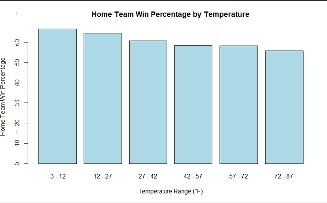
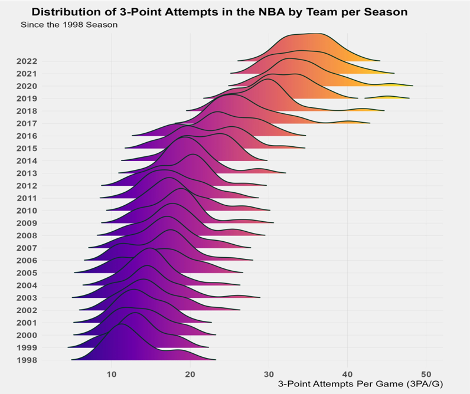

# Aspiring Data Analyst 

**Technical Skills:** R, SAS and Python   
**Certified in:** Microsoft Excel, Word and Powerpoint   
**Phone Number:** 504-439-1787   
**Email:** kylehardy3118@gmail.com   

## Education 
- B.S., Statistics | North Carolina State University (_May 2024_)

## Work Experience
**Data Collection Team Leader**           
Institute for Transportation Research and Education     
(_May 2023 - August 2023_)
- Managed and guided a team of researchers, ensuring quality control and accuracy in the data collection processes
- Observed and assisted professional statisticians in performing a statewide seatbelt study

## Projects

### Predicting NFL Outcomes Based on Weather
[Report](Predicting_NFL_Outcomes_Based_on_Weather.pdf)

10-page report and simulation study to analyze if adverse weather actually impacts home field advantage in the NFL.

_Page 4 of Report_

### NBA Data
[Report](NBA_Data_Report.pdf)

10-page report on how the style of gameplay in the NBA has changed or remained the same since 1998.

_Page 5 of Report_
