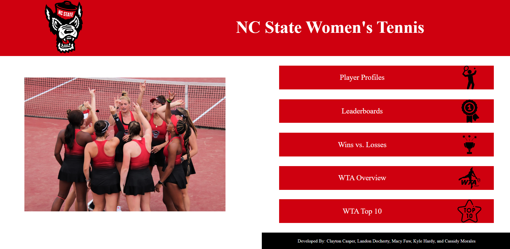

# Data Enthusiast 

**Technical Skills:** Python, Tableau, SQL and R   
**Certifications:** PCEP Certified Entry-Level Python Programmer  
## Contact Me 
**Phone Number:** 504-439-1787     
**Email:** kwhardy@ncsu.edu  
**Linkedin:** [https://www.linkedin.com/in/kyle-w-hardy](https://www.linkedin.com/in/kyle-w-hardy)  

## Education 
- M.S., Analytics | Institute for Advanced Analytics (_May 2025_)
- B.S., Statistics | North Carolina State University (_May 2024_)

## Practicum  
**Technical Lead**  
Elevate  
(_August 2024 - Current_)  
- Collaborating with a team of 5 to understand the decline in Direct Mail (DM) offer response rates by identifying missing customer populations
- Performing clustering for variable reduction on extensive credit data with over 10,000 variables and 10MM customer records using Python
- Presenting insights from statistical analyses of past DM model predictions based on key features identified
- Developing and interpreting linear and non-linear models to predict new responder populations

## Work Experience
**Data Collection Team Lead**           
Institute for Transportation Research and Education     
(_April 2023 - August 2023_)
- Managed and guided a team of researchers, ensuring quality control and accuracy in the data collection processes
- Observed and assisted professional statisticians in performing a statewide seatbelt study

## Projects

### NCSU Women's Tennis Dashboard
[Dashboard](https://public.tableau.com/app/profile/landon.docherty/viz/NCSUWomensTennis-3-2-2/HomePage)

Designed and developed a dynamic Tableau dashboard for NCSU Women's Tennis, visualizing player statistics, match outcomes, and performance.

_Dashboard Homepage_

### Sentiment Analysis of Presidential Inaugural Speeches
[Project](./Text%20Analytics/Orange%207%20Text%20Analytics.pdf)

Conducted sentiment analysis of U.S. presidential inaugural speeches using Python, identifying trends and insights from historical and modern text data.

_Slide 8 of Presentation_

### Predicting NFL Outcomes Based on Weather
[Report](Predicting_NFL_Outcomes_Based_on_Weather.pdf)

10-page report and simulation study to analyze if adverse weather actually impacts home field advantage in the NFL.

_Page 4 of Report_

